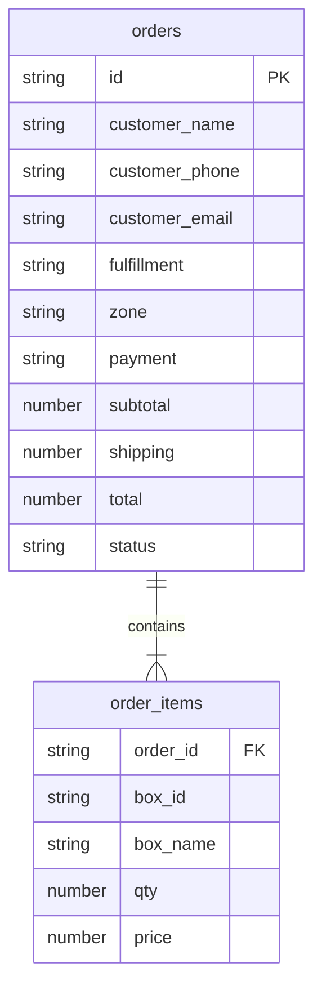
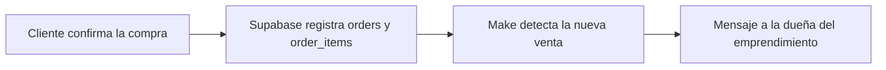

# Granja Shalom

> **Del surco a tu mesa, sin escalas.**
>
> Una experiencia de compra digital para acercar cajas de verdura agroecológica, fresca y local a las familias de Bahía Blanca.

<p align="center">
    
  
  
  
    
</p>

## El desafío

Las familias productoras locales necesitan vender con previsibilidad y las personas quieren comprar alimentos frescos sin fricción. Granja Shalom convierte una oferta semanal de cosecha en un recorrido claro: elegir una caja, conocer su contenido, coordinar retiro o envío y registrar el pedido en pocos pasos.

## Qué hace especial a la experiencia

- **Compra pensada para móvil:** navegación directa, carrito siempre accesible y acciones cómodas con una mano.
- **Oferta fácil de entender:** tres tamaños de caja, contenido visible, precios en pesos argentinos y una opción destacada.
- **Logística local integrada:** retiro en Charcas 1769 o entrega por zonas de Bahía Blanca con cálculo automático del envío.
- **Checkout conversacional:** datos de contacto, método de pago y comprobante de transferencia dentro del mismo flujo.
- **Continuidad humana:** WhatsApp aparece como canal de acompañamiento antes y después del pedido.
- **Una experiencia con identidad:** fotografía de producto, microinteracciones y una estética cálida inspirada en la tierra y la cosecha.

## Demo en 60 segundos

1. Entrá a `/` y elegí **Ver las cajas**.
2. Abrí **Caja Cosecha**, la opción más elegida, y sumá una unidad.
3. En el carrito, revisá cantidades y avanzá a los datos de entrega.
4. Probá **Envío a domicilio** y cambiá la zona para ver cómo se actualiza el total.
5. En el paso de pago, explorá Mercado Pago, transferencia o efectivo.
6. Con Supabase configurado, confirmá el pedido y consultá la pantalla de resumen. La automatización de Make notifica a la dueña del emprendimiento cuando la venta queda registrada.

> **Nota sobre pagos:** el botón de Mercado Pago simula una redirección y aprobación para mostrar el recorrido completo. No procesa dinero real todavía. Transferencia y efectivo completan el registro del pedido según la opción elegida.

## Funcionalidades

| Área | Experiencia |
| --- | --- |
| Inicio | Propuesta de valor, hero visual, beneficios y cajas destacadas |
| Catálogo | Cajas Semilla, Cosecha y Abundancia con contenido y precio |
| Detalle | Foto, cantidad de productos, composición y selector de unidades |
| Carrito | Edición de cantidades, eliminación, subtotal y resumen durante la sesión |
| Entrega | Retiro sin cargo o envío por zona con costo calculado automáticamente |
| Pago | Mercado Pago en modo demo, transferencia con alias y comprobante, o efectivo |
| Persistencia | Registro de pedidos e ítems en Supabase |
| Automatización | Make envía una notificación a la dueña cuando se confirma una venta |
| Confirmación | ID del pedido, resumen, estado del pago, modalidad y contacto por WhatsApp |

## Stack

- **React 19** + **TypeScript 5.7** para una interfaz tipada y modular.
- **Vite 8** para desarrollo rápido y builds optimizados.
- **Tailwind CSS 4** para el sistema visual responsive.
- **React Router 7** para el flujo de pantallas de la tienda.
- **Supabase JS 2** para registrar pedidos y sus ítems.
- **Make** para automatizar la notificación de nuevas ventas a la dueña del emprendimiento.
- **pnpm** para instalar dependencias y ejecutar scripts.

## Puesta en marcha

### Requisitos

- Node.js compatible con la versión declarada en `.mise.toml`.
- pnpm.
- Un proyecto de Supabase si querés probar el registro real de pedidos.

### Instalación

```bash
pnpm install
pnpm dev
```

Abrí la URL que muestre Vite, normalmente [http://localhost:8443](http://localhost:8443).

### Variables de entorno

Creá `.env.local` en la raíz:

```env
VITE_SUPABASE_URL=https://tu-proyecto.supabase.co
VITE_SUPABASE_ANON_KEY=tu-clave-anonima
```

La aplicación usa la clave pública `anon` desde el cliente. **Nunca** expongas una clave `service_role` en una variable `VITE_*`.

Sin estas variables, la interfaz puede recorrerse, pero la confirmación del pedido no podrá guardarse en Supabase ni disparar la automatización asociada.

## Modelo de datos

El flujo de pedidos escribe en dos tablas relacionadas:



`orders` recibe el pedido principal con estado inicial `pending`; `order_items` conserva el nombre y precio de cada caja al momento de la compra. En Supabase, configurá la relación entre `order_items.order_id` y `orders.id`, junto con políticas RLS que permitan únicamente las operaciones necesarias.

## Automatización de ventas

Después de registrar una venta en Supabase, un escenario de **Make** detecta el nuevo pedido y envía un mensaje a la dueña del emprendimiento. Así, cada compra digital llega rápidamente al canal operativo sin depender de revisar manualmente la base de datos.



La automatización desacopla la experiencia de compra de la gestión diaria: el frontend registra la operación y Make se ocupa de acercar la novedad a quien prepara y coordina el pedido.

## Arquitectura del proyecto

```text
src/
├── App.tsx                  # Estado del carrito, checkout y rutas
├── index.css                # Tailwind y sistema visual global
├── components/              # Controles y piezas reutilizables
├── data/                    # Productos, contacto y zonas de entrega
├── lib/
│   ├── orders.ts            # Escritura de pedidos en Supabase
│   └── supabase.ts          # Inicialización del cliente
├── pages/                   # Inicio, catálogo, detalle, checkout y confirmación
├── types/                   # Contratos compartidos de TypeScript
└── utils/                   # Navegación y formato de moneda
public/                      # Recursos públicos, incluido el favicon
```

Las decisiones de negocio más visibles están centralizadas en [src/data/products.ts](src/data/products.ts), [src/data/deliveryZones.ts](src/data/deliveryZones.ts) y [src/data/contact.ts](src/data/contact.ts). El flujo de compra y sus rutas viven en [src/App.tsx](src/App.tsx).

## Rutas principales

| Ruta | Pantalla |
| --- | --- |
| `/` | Inicio |
| `/productos` | Catálogo |
| `/productos/:id` | Detalle de una caja |
| `/carrito` | Carrito |
| `/checkout` | Datos y modalidad de entrega |
| `/checkout/pago` | Método de pago |
| `/pedido/:id` | Confirmación |

## Scripts

| Comando | Uso |
| --- | --- |
| `pnpm dev` | Inicia Vite en modo desarrollo |
| `pnpm build` | Genera el build de producción en `dist/` |
| `pnpm preview` | Sirve localmente el build generado |
| `pnpm format` | Formatea el código con Oxfmt |

## Decisiones y alcance

Esta versión prioriza el recorrido completo de compra y la claridad para una operación local. El pedido se mantiene en estado de sesión después de la confirmación, sus datos quedan registrados en Supabase y la venta confirmada dispara la notificación operativa mediante Make.

### Próxima cosecha

- Integrar el procesamiento real de Mercado Pago y validar webhooks.
- Subir comprobantes a Supabase Storage en lugar de conservar solo el nombre del archivo.
- Añadir un panel para productores: pedidos, estados, disponibilidad y zonas.
- Persistir la consulta de pedidos y permitir seguimiento por WhatsApp.
- Incorporar autenticación, validaciones server-side y observabilidad para producción.

## Despliegue

```bash
pnpm build
```

Publicá `dist/` en un hosting compatible con una SPA. Configurá `VITE_SUPABASE_URL` y `VITE_SUPABASE_ANON_KEY` durante el build y habilitá el fallback de rutas hacia `index.html` para que React Router funcione al recargar una URL interna.

## Seguridad para producción

- Aplicá RLS en todas las tablas de Supabase.
- Recalculá precios, envío y total en un entorno confiable; no tomes el total del navegador como fuente de verdad.
- Validá formato y tamaño de comprobantes antes de almacenarlos.
- Protegé las credenciales privadas y mantenelas fuera del bundle del frontend.
- Convertí el pago simulado de Mercado Pago en una integración confirmada por backend/webhook.

## Equipo desarrollador

Proyecto desarrollado para el hackathon por:

| Integrante | Participación |
| --- | --- |
| **Roxana** | Desarrollo |
| **Sandra** | Desarrollo |
| **Daniela** | Desarrollo |

## Créditos

Hecho por **Roxana, Sandra y Daniela** para mostrar que la tecnología también puede achicar la distancia entre quien cultiva y quien come. 🌱
